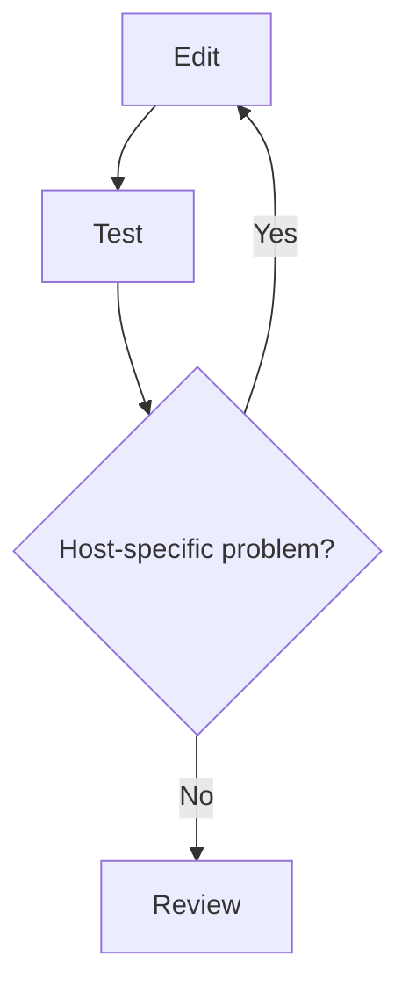

# Yash Sharma — Portfolio Website

[](https://github.com/jnanic/jnanic.github.io/actions/workflows/deploy.yml)

The source for [yashsharma.dev](https://yashsharma.dev), a statically exported portfolio and engineering blog built with Next.js, TypeScript, Tailwind CSS, and Framer Motion.

## What is included

- A responsive homepage with hero, about, projects, writing, and contact sections
- A persisted light/dark theme
- Interactive circuit, particle, cursor, and project-card effects, with reduced-motion handling
- A file-based Markdown blog with frontmatter, reading times, syntax-friendly article styles, and Mermaid diagrams
- SEO metadata, JSON-LD for posts, a sitemap, `robots.txt`, favicons, and a custom 404 page
- Automated static deployment to GitHub Pages

## Local development

The Next.js application lives in `site/`, so run application commands there. Node.js 20 is recommended because it matches CI.

```bash
cd site
npm ci
npm run dev
```

Open <http://localhost:3000>. To verify the production export:

```bash
cd site
npm run build
```

The production build is written to `site/out/`. `npm run lh` runs the desktop and mobile Lighthouse checks against that export; it downloads the pinned Lighthouse CI CLI when needed and writes ignored reports under `site/lighthouse/reports/`.

## Editing content

Projects are typed records in `site/data/projects.ts`. Each project can provide GitHub, demo, and website links.

Blog posts are Markdown or MDX files in `site/content/blog/`. Supported frontmatter fields are:

```yaml
---
title: "Post title"
description: "Short summary"
publishedDate: "2026-08-21"
updatedDate: "2026-08-22" # optional
draft: false
tags:
  - homelab
coverImage: "/blog/example.jpg" # optional
---
```

Production builds exclude drafts from the blog index and sitemap.

### Mermaid diagrams

Mermaid fences accept a semantic size and a quoted visible caption:

````markdown

````

`size` may be `compact`, `standard`, or `wide`; it defaults to `standard`. Each preset is a maximum: diagrams keep their natural Mermaid width when they are smaller and scale down responsively when they exceed the preset or viewport. Unusually tall compact diagrams are also scaled to a bounded inline height, with their full-size version available through the keyboard-accessible expanded view. Wide or naturally overfull diagrams receive the same expanded view. Every diagram should include `accTitle` and `accDescr`, and its labels, shapes, grouping, and edge styles must communicate the structure without relying on color. Pixel widths are intentionally unsupported.

Architecture diagrams can assign the shared semantic node roles `source`, `control`, `approved`, `denied`, and `decision` with Mermaid `class` statements. A native control-plane cluster may use `management` when no links cross its boundary; layout-only nodes or subgraphs use `layout` to participate in alignment without becoming visible content. The renderer owns their accessible light and dark palettes, typography, borders, and shapes; posts should not repeat palette values in `classDef` declarations. Use a dashed, explicitly labeled connector for a denied or blocked path so color is never the only signal. Mermaid is pinned to `11.16.1` so layout changes arrive only through an intentional dependency update.

When arrows must cross a management boundary, do not place their endpoint nodes inside a Mermaid subgraph: Mermaid clips those routes at the subgraph edge. Keep the nodes in the main flow and declare a renderer-owned visual panel in a Mermaid comment instead:

```text
%% panel MGMT "Management VM": DEV,RELEASE,DENIED
```

The listed node IDs determine the panel bounds while the underlying links remain true node-to-node connections.

Public assets belong in `site/public/` and are referenced from the site root, for example `/avatar.jpeg`.

## Repository map

```text
.
├── .github/workflows/deploy.yml  # GitHub Pages build and deployment
├── AGENTS.md                     # Instructions for coding agents
├── README.md                     # Setup and content authoring
├── WEBSITE_STRUCTURE.md          # Architecture reference
└── site/
    ├── app/                      # App Router routes, metadata, and global CSS
    ├── components/               # Homepage, navigation, effects, and blog UI
    ├── content/blog/             # Markdown posts
    ├── data/projects.ts          # Project records
    ├── lib/blog.ts               # Build-time blog loading and Markdown rendering
    ├── public/                   # Images, CV, icons, CNAME, and .nojekyll
    ├── lighthouse/               # Budgets and ignored generated reports
    └── scripts/run-lh.mjs        # Lighthouse CI runner
```

See [WEBSITE_STRUCTURE.md](WEBSITE_STRUCTURE.md) for route ownership, rendering boundaries, and visual-layer details.

## Deployment

Pushes to `master` or `main` trigger `.github/workflows/deploy.yml`. The workflow:

1. Installs dependencies in `site/` with `npm ci`.
2. Creates the static export with `npm run build`.
3. Runs Lighthouse as a non-blocking reporting step.
4. Uploads `site/out/` and deploys it to GitHub Pages.

The custom domain is configured by `site/public/CNAME`. Next.js emits trailing-slash routes and uses unoptimized images so the exported files work on GitHub Pages.

## License

© 2025 Yash Sharma. All rights reserved.
