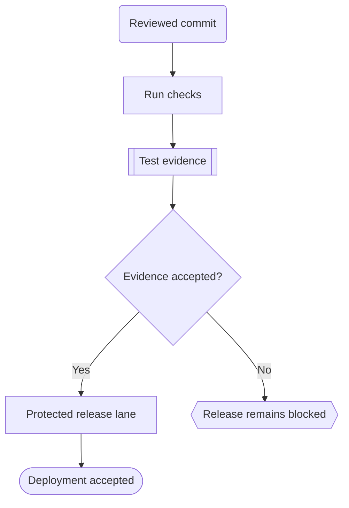

# Yash Sharma — Portfolio Website

[](https://github.com/jnanic/jnanic.github.io/actions/workflows/deploy.yml)

The source for [yashsharma.dev](https://yashsharma.dev), a statically exported portfolio and engineering blog built with Next.js, TypeScript, Tailwind CSS, and Framer Motion.

## What is included

- A responsive homepage with hero, about, projects, writing, and contact sections
- A persisted light/dark theme
- Interactive circuit, particle, cursor, and project-card effects, with reduced-motion handling
- A file-based Markdown blog with frontmatter, reading times, syntax-friendly article styles, and Mermaid diagrams
- SEO metadata, JSON-LD for posts, a sitemap, `robots.txt`, favicons, and a custom 404 page
- Automated static deployment to GitHub Pages

## Local development

The Next.js application lives in `site/`, so run application commands there. Node.js 20 is recommended because it matches CI.

```bash
cd site
npm ci
npm run dev
```

Open <http://localhost:3000>. To verify the production export:

```bash
cd site
npm run build
```

The production build is written to `site/out/`. `npm run lh` runs the desktop and mobile Lighthouse checks against that export; it downloads the pinned Lighthouse CI CLI when needed and writes ignored reports under `site/lighthouse/reports/`.

## Editing content

Projects are typed records in `site/data/projects.ts`. Each project can provide GitHub, demo, and website links.

Blog posts are Markdown or MDX files in `site/content/blog/`. Supported frontmatter fields are:

```yaml
---
title: "Post title"
description: "Short summary"
publishedDate: "2026-08-21"
updatedDate: "2026-08-22" # optional
draft: false
tags:
  - homelab
coverImage: "/blog/example.jpg" # optional
---
```

Production builds exclude drafts from the blog index and sitemap.

### Mermaid diagrams

Mermaid fences accept a semantic size and a quoted visible caption:

````markdown

```mermaid size=compact caption="Reviewed release flow"
flowchart TB
    accTitle: Reviewed release flow
    accDescr: A reviewed commit is tested, produces evidence, and reaches a human approval gate. Acceptance opens the protected release lane; rejection leaves the release blocked.

    COMMIT("Reviewed commit")
    TEST["Run checks"]
    EVIDENCE[["Test evidence"]]
    REVIEW{"Evidence accepted?"}
    RELEASE["Protected release lane"]
    DONE(["Deployment accepted"])
    BLOCKED{{"Release remains blocked"}}

    COMMIT --> TEST --> EVIDENCE --> REVIEW
    REVIEW -->|"Yes"| RELEASE --> DONE
    REVIEW -->|"No"| BLOCKED

    class COMMIT source;
    class TEST process;
    class EVIDENCE evidence;
    class REVIEW human;
    class RELEASE,DONE approved;
    class BLOCKED failure;
```
````

`size` may be `compact`, `standard`, or `wide`; it defaults to `standard`. Each preset is a maximum: diagrams keep their natural Mermaid width when they are smaller and scale down responsively when they exceed the preset or viewport. Unusually tall compact diagrams are also scaled to a bounded inline height, with their full-size version available through the keyboard-accessible expanded view. Wide semantic diagrams stop shrinking when their 15px labels would fall below 11px and use contained horizontal scrolling instead; wide or naturally overfull diagrams also receive the expanded view. Every diagram should include `accTitle` and `accDescr`, and its labels, shapes, grouping, and edge styles must communicate the structure without relying on color. Pixel widths are intentionally unsupported.

#### Semantic shape and class contract

New or revised technical diagrams use this shared contract. Shape and label carry the primary meaning; the renderer supplies the accessible light and dark colors.

| Meaning | Mermaid form | Class |
| --- | --- | --- |
| Source or immutable input | `("Text")` | `source` |
| Process or action | `["Text"]` | `process` |
| Human decision or approval gate | `{"Text"}` | `human` |
| Failure or blocked state | `{{"Text"}}` | `failure` |
| Warning or open gap | `{{"Text"}}` | `warning` |
| Successful or accepted outcome | `(["Text"])` | `approved` |
| Evidence or generated artifact | `[["Text"]]` | `evidence` |
| Protected process or lane | `["Text"]` | `approved` |

The shared theme renders sources and evidence in blue, ordinary processes in gray with a blue border, human gates and unresolved warnings in amber, failures and blocked states in red, and protected lanes or verified outcomes in green. Diamonds must ask real questions and use labeled branches when more than one outcome exists. Hexagons identify abnormal states, stadiums identify completed outcomes, rectangles contain work, and double rectangles contain evidence. Meaning must remain clear in monochrome.

The renderer is the color source of truth. Blog Markdown must not contain diagram-local `init`, `classDef`, hard-coded `fill`, or hard-coded `stroke` declarations. Existing legacy roles remain supported for older posts, but new work should use the contract above. A native control-plane cluster may use `management` when no links cross its boundary; layout-only nodes or subgraphs use `layout` to participate in alignment without becoming visible content. Mermaid is pinned to `11.16.1` so layout changes arrive only through an intentional dependency update.

When arrows must cross a management boundary, do not place their endpoint nodes inside a Mermaid subgraph: Mermaid clips those routes at the subgraph edge. Keep the nodes in the main flow and declare a renderer-owned visual panel in a Mermaid comment instead:

```text
%% panel MGMT "Management VM": DEV,RELEASE,DENIED
```

The listed node IDs determine the panel bounds while the underlying links remain true node-to-node connections. Panels support the rectangular, polygonal, and stadium shapes in the semantic contract. Use this mechanism when grouped nodes have incoming or outgoing links: Mermaid ignores a subgraph's requested direction when its nodes connect outside that subgraph, which can collapse parallel lanes into a single tall column.

Public assets belong in `site/public/` and are referenced from the site root, for example `/avatar.jpeg`.

## Repository map

```text
.
├── .github/workflows/deploy.yml  # GitHub Pages build and deployment
├── AGENTS.md                     # Instructions for coding agents
├── README.md                     # Setup and content authoring
├── WEBSITE_STRUCTURE.md          # Architecture reference
└── site/
    ├── app/                      # App Router routes, metadata, and global CSS
    ├── components/               # Homepage, navigation, effects, and blog UI
    ├── content/blog/             # Markdown posts
    ├── data/projects.ts          # Project records
    ├── lib/blog.ts               # Build-time blog loading and Markdown rendering
    ├── public/                   # Images, CV, icons, CNAME, and .nojekyll
    ├── lighthouse/               # Budgets and ignored generated reports
    └── scripts/run-lh.mjs        # Lighthouse CI runner
```

See [WEBSITE_STRUCTURE.md](WEBSITE_STRUCTURE.md) for route ownership, rendering boundaries, and visual-layer details.

## Deployment

Pushes to `master` or `main` trigger `.github/workflows/deploy.yml`. The workflow:

1. Installs dependencies in `site/` with `npm ci`.
2. Creates the static export with `npm run build`.
3. Runs Lighthouse as a non-blocking reporting step.
4. Uploads `site/out/` and deploys it to GitHub Pages.

The custom domain is configured by `site/public/CNAME`. Next.js emits trailing-slash routes and uses unoptimized images so the exported files work on GitHub Pages.

## License

© 2025 Yash Sharma. All rights reserved.
