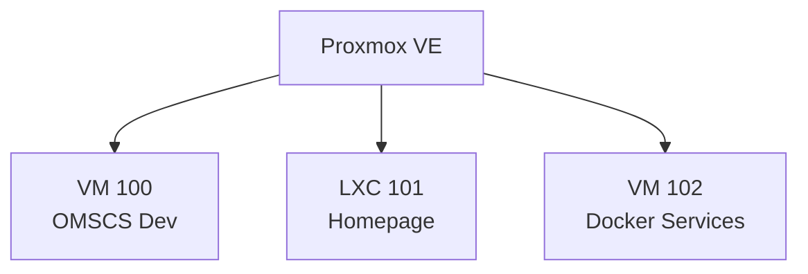
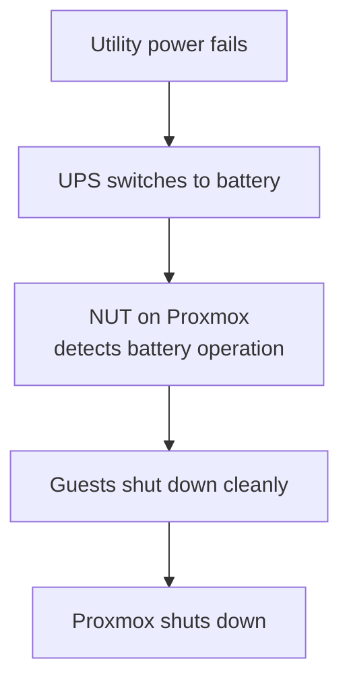

Part 1 of this homelab was mostly about planning: choosing hardware, deciding what Proxmox would manage, and figuring out which services deserved their own VM or container.

Part 2 was where all of that met reality.

The result is now a functioning Proxmox host with a development VM, a dedicated Docker VM, a monitoring dashboard, remote access, tested backups, UPS-controlled shutdown, and the first batch of self-hosted applications.

More importantly, several assumptions from the original plan changed once I had real hardware, old disks, actual workloads, and a few unexpected errors in front of me.

## The plan changed almost immediately

Part 1 ended with a neat phased plan.

Some things happened exactly as expected: Proxmox went on the bare metal, the Ubuntu development VM became the first major workload, the stock cooler provided a thermal baseline, and the old disks had to prove they were trustworthy before being reused.

Other parts moved around considerably.

The UPS was originally a later upgrade, but unreliable power made it worth solving early. The application architecture changed too. I had expected several small services to live directly in lightweight containers. Instead, general containerized applications received their own Debian VM running Docker, while Homepage stayed in a small dedicated LXC.

The storage plan changed the most. SMART data retired two old drives, gave one healthy drive a dedicated backup role, and left the remaining data disks mounted read-only until I could build the long-term storage layer properly. Paperless was postponed until that storage, its permissions, snapshots, and backups exist.

FreshRSS and Gramps Web, neither of which appeared in the original plan, were useful enough to move in early. The expected 64 GB RAM upgrade moved the other way: it stayed in the future because measurements have not justified it yet.

That became the rule for the rest of the build:

> **The roadmap is a hypothesis. Measurements get the final vote.**

## The hardware became a server

The current machine is built around:

```text
Intel Core i5-14400
ASUS EX-B760M-V5 D4
32 GB DDR4
WD Black SN7100 500 GB NVMe
Corsair RM750e 750 W
Proxmox VE 9
```

Proxmox runs directly on the hardware, with the NVMe handling the hypervisor and virtual-machine storage.

The first useful reality check came from CPU temperatures. During an early stress test, the processor reached roughly **91°C** with the stock cooler. That was exactly why I started with it: establish a real baseline before buying another part. The experiment did its job, and better cooling moved onto the upgrade list.

## Keeping Proxmox boring

One design rule has become increasingly important:

> **Keep the hypervisor boring.**

Proxmox runs virtualization, backups, UPS monitoring, and a small amount of host-level telemetry. General applications do not get installed directly on it.



The separation costs a little memory, but it makes ownership clear. If Docker breaks, it is a Docker VM problem. If Homepage breaks, it is a small LXC problem. Neither should become a Proxmox-host problem.

## A development VM with a tested backup

VM 100, `omscs-dev`, became my main Ubuntu development environment. Its 100 GB NVMe-backed virtual disk and larger memory allocation give coursework, programming, and AI experiments somewhere to live without filling the Proxmox host with compilers, Python environments, and research tooling.

Creating the VM was uneventful. The more important step came afterward.

I created a clean snapshot, made a complete Proxmox backup, and restored it into a temporary VM. The restored machine booted correctly and worked. Only then did I remove the temporary copy.

A backup file proves that a job ran. A successful restore proves considerably more.

## Remote access without opening router ports

Tailscale now connects my laptop, Proxmox, and the development VM. At home I use normal LAN access; remotely I use the private Tailscale network and SSH aliases.

No Proxmox or SSH management ports are forwarded through the router. Remote access has remained pleasantly uneventful, which is exactly what I want from infrastructure.

## Pulling the plug on purpose

Power reliability is a real concern where this server runs, so an APC Back-UPS is connected directly to Proxmox. Network UPS Tools handles the shutdown path:



I tested it by actually removing utility power. After five minutes on battery, the guests shut down cleanly, followed by Proxmox.

Automatic startup when electricity returns is still deferred because that depends on UPS and motherboard behavior. Controlled shutdown, however, is now something I have observed rather than something I hope works.

## Old hard drives became a recovery project

SMART testing separated the old disks into healthy drives, aging drives, and two drives that were clearly finished.

The worst 1 TB Seagate had hundreds of reallocated sectors along with pending and uncorrectable sectors. I recovered important folders onto a healthier 2 TB disk and verified them before wiping and retiring the failing drive.

Another 500 GB drive had **224 reallocated sectors** and more than **45,000 power-on hours**. Nothing important remained on it, so it was also identified, wiped, and removed.

That process produced one of the strictest rules in the homelab:

> **`/dev/sdX` is useful for inspecting disks. It is not good enough for deciding which disk to erase.**

Destructive storage work now starts by checking the model, serial number, capacity, mount state, ownership, and stable `/dev/disk/by-id` identifier. The remaining NTFS data disks are still mounted read-only. Migration comes before repurposing.

## Homepage started small

The first dedicated dashboard service was Homepage. I installed it directly from source inside a small Debian LXC instead of running another Docker engine solely for a dashboard.

```text
1 vCPU
1 GB RAM
512 MB swap
8 GB disk
```

Rather than increasing the memory pre-emptively, I ran the production build and watched its resource usage. The build completed successfully, peaked around **863 MiB RAM**, and touched only a small amount of swap. Normal runtime later settled to roughly **123 MB RAM**.

At this stage Homepage was only the beginning of a dashboard. Most of the services it would eventually display did not exist yet.

## Giving applications their own Docker VM

General containerized services run inside VM 102, `docker-services`, a headless Debian 13 VM with:

```text
4 vCPU
6 GB maximum RAM
64 GB NVMe-backed disk
```

Docker came from its official Debian repository. I also bounded its log storage early so a noisy container cannot quietly fill the VM disk.

The filesystem layout is intentionally predictable:

```text
/srv/homelab/compose   deployment definitions
/srv/appdata           persistent application state
/etc/homelab           credentials and secrets
```

The future Git repository can contain deployment definitions. It will not contain live credentials or application state.

## Capacity planning one service at a time

The physical host has **32 GB RAM**, while the development VM alone can use up to 16 GB. I therefore avoided installing the entire application stack at once.


n8n went in first, followed by FreshRSS and Gramps Web. Before adding another significant service, I measured the VM again. With those services, shared PostgreSQL, and the Docker monitoring proxy running, the result was:

```text
Total RAM       5.7 GiB
Used            2.9 GiB
Available       2.8 GiB
```

That left enough room to test Open WebUI without increasing the allocation first.

Gramps Web also demonstrated why container count is not the same as service count. Its web application, Celery worker, and Valkey instance together use roughly **1.7 GiB RAM at idle**. Future observability should present those containers as one workload with an optional drill-down.

## Open WebUI provided another useful experiment

The last application added for Part 2 was Open WebUI, running locally while OpenRouter provides access to external models.

Its first startup was heavier than the smaller services because it had to initialize and migrate its database. Memory briefly reached roughly **899 MiB** with high CPU utilization, then settled to about **715 MiB**. Startup peaks matter when sizing a small server; idle numbers do not tell the whole story.

The first free model I tried produced the wonderfully unhelpful frontend message:

```text
Provider returned error
```

The backend log was more useful:

```text
HTTP 429
rate_limited
```

Switching models produced a successful response and validated the complete path:


The OpenRouter API key remains outside Compose and outside Git.

## Homepage became the front door

Only after the Docker VM and its applications existed did Homepage become the front door to the homelab.


It now provides one view of Proxmox, the development VM, Docker Services, PostgreSQL, n8n, FreshRSS, Gramps Web, and Open WebUI. Even the Georgia Tech icon on the OMSCS card is served locally; every dashboard refresh does not need to fetch a tiny image from somebody else's server.

Homepage needs infrastructure data, but it does not need infrastructure control. For Proxmox, it uses a dedicated account and privilege-separated API token with the built-in **PVEAuditor** role. It can read VM and LXC statistics but cannot reconfigure or power-manage them.

Docker follows the same principle. Instead of receiving direct access to `/var/run/docker.sock`, Homepage talks to a socket proxy that exposes only the required read operations. `POST` access is disabled, and persistent firewall rules allow only the Homepage LXC to reach the proxy.

## Measurements changed the memory allocation

After Open WebUI joined the stack, I repeated the capacity check:

```text
3.5 GiB used
2.2 GiB available
```

Swap contained roughly 150 MiB, but `vmstat` showed no active swapping during normal idle operation: swap-in and swap-out stayed at zero after the initial cumulative sample.

The approximate service-level RAM breakdown was:

| Service | Idle RAM |
| :--- | ---: |
| Gramps Web + Celery + Valkey | ~1.7 GiB |
| Open WebUI | ~715 MiB |
| n8n | ~341 MiB |
| FreshRSS | ~55 MiB |
| Shared PostgreSQL | ~57 MiB |
| Docker socket proxy | ~18 MiB |

Those measurements exposed a configuration that no longer made sense. The Docker VM had a **6 GB maximum**, but Proxmox could balloon it down to **2 GB**. A VM normally using around 3.5 GB should not be squeezed to 2 GB simply because the configuration permits it.

The host still had roughly **16 GB available**, so I raised the balloon minimum:

```text
Before: 2 GB minimum / 6 GB maximum
After:  4 GB minimum / 6 GB maximum
```

The method throughout was simple: measure capacity, add one workload, measure again, and change the allocation only when observed behavior justified it.

## Backups became deliberately boring

By this point all three guests existed, so the broader backup plan could finally cover the system I had actually built.

One healthy 500 GB WD Green now has exactly one job: **Proxmox backups**. A scheduled job covers the development VM, Homepage LXC, and Docker VM every morning using snapshot mode and zstd compression.

Retention is intentionally small:

```text
2 daily restore points
1 weekly restore point
```

The development VM has a 100 GB virtual disk, but its compressed backups are only around **10 GB**. Virtual capacity and backup size are very different when unused blocks and compressible data are involved.

I also keep separate host-configuration archives containing important Proxmox, networking, and NUT configuration. Each archive gets a SHA-256 checksum. The final Part 2 checkpoint was archived and verified successfully.

## Where Part 2 ends

The homelab has crossed an important boundary.

Proxmox is stable. Backups are automated and restore-tested. UPS shutdown has survived a real power-cut test. Remote access works without exposing management ports publicly. Failing disks have been recovered and retired. Homepage shows useful telemetry without broad administrative credentials. General applications live in their own Docker VM, with configuration, state, and secrets kept in clear locations. That VM is sized using measurements from the workloads it actually runs.

The next major hardware component is still in transit: a **10 TB Seagate IronWolf**.

Part 3 will shift from compute and applications to storage: identifying and burn-in testing the new drive, creating a TrueNAS VM, building the first ZFS pool, migrating data from the remaining read-only NTFS disks, and then expanding the application stack on top of that storage.

The parts I increasingly trust are the boring ones: backups that have actually restored, shutdown behavior that has actually been tested, restricted credentials, predictable ownership, and resource allocations based on measured workloads.

That feels like the point where a collection of hardware and configuration files started becoming an actual homelab.
