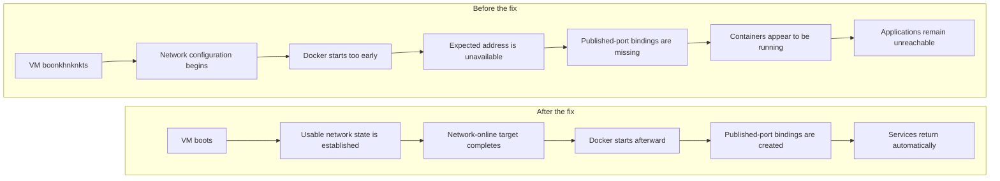
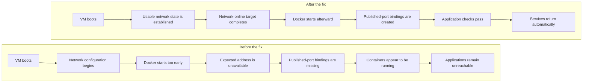
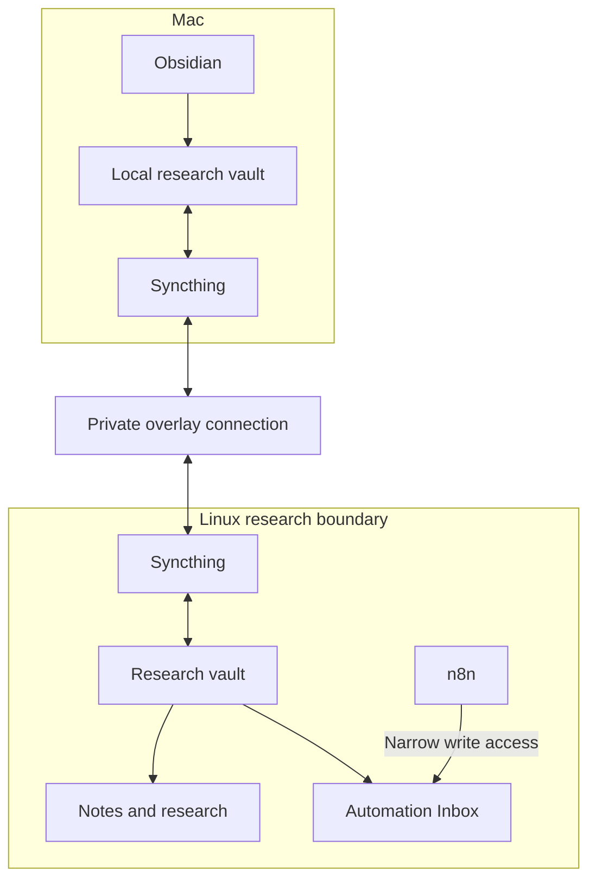

Part 2 ended with the homelab in a surprisingly stable place.

Proxmox was running useful workloads. Remote access worked without public management ports. The UPS had survived a real shutdown test. Backups were scheduled, Homepage showed useful telemetry, and general applications had their own Docker VM.

The next step was supposed to be storage.

A new 10 TB NAS drive was on the way. The plan was to test it, build a TrueNAS VM, create the first ZFS pool, and begin migrating data from the old read-only disks.

That is not what happened.

Instead, Part 3 became a collection of failures, recovery work, and smaller infrastructure improvements: a new disk that could not reliably read data, Docker containers that were running but unreachable, a backup audit that found no application backups, and a Todoist dashboard that became much more complicated than the problem deserved.

The storage pool still does not exist. The homelab is better anyway!

## The new drive failed before it stored anything

The first 10 TB drive arrived shortly after Part 2.

Before doing anything destructive, I followed the disk-intake process that the old-drive recovery work had taught me to use. I confirmed the model, capacity, stable identity, mount state, and current ownership using private evidence.

The drive appeared correctly. It had the expected capacity, and nothing was mounted from it.

That was where the good news ended.

SMART information was unavailable, and even a minimal read from the disk failed. The kernel reported repeated device-not-ready and I/O errors.

A single failure could still have meant a loose cable, a bad motherboard port, or a power problem, so I tested the drive through several paths:

- a different SATA data cable;
- a different power connection;
- a known-good motherboard port;
- a complete cold power cycle; and
- a power, cable, and port combination already working with another disk.

The failure followed the drive.

At that point, continuing would not have produced useful evidence. Formatting the disk would not fix a hardware communication problem. A destructive surface test would add risk without answering a new question.

The drive was classified as defective on arrival and returned without being partitioned, formatted, wiped, or added to a pool.

Apparently, storage had read the Part 2 roadmap and objected to the schedule.

The important result was not simply “the disk was bad.” It was that the intake process failed safely. No existing disk was mistaken for the new one, no data-bearing drive was modified, and the failed drive never became part of the storage architecture.

## Restoring the old storage layout

Testing the new disk required temporarily moving some of the existing SATA connections, so the next job was putting everything back.

The dedicated Proxmox backup disk returned to its backup-only role. The remaining legacy data disks returned to their read-only source roles.

I reviewed their SMART health data and ran short self-tests. The tests completed without error. One older disk still carried historical interface-error evidence, but the counter had not increased after the cable work, so I recorded it as historical rather than treating it as a new failure.

This distinction matters. SMART attributes often contain the entire history of a disk. A non-zero counter does not automatically mean a drive is currently deteriorating. The useful question is whether the value is changing and whether it agrees with current read errors, kernel logs, or failed self-tests.

The old disks remain temporary. They are sources awaiting migration, not members of the future storage pool.

That boundary survived the failed-drive experiment intact.

## Docker was running, but nothing could reach it

The storage work caused the core Docker VM to restart.

After boot, Docker reported that the containers were running. Several applications even showed healthy internal state.

Their published ports were missing.

From Docker’s point of view, the services existed. From the network’s point of view, they did not.

The VM publishes application ports on a specific private address rather than every interface. During the failed boot, Docker started before the VM had finished obtaining that address. The containers retained the requested port configuration, but the runtime bindings and corresponding network rules never appeared.

The temporary recovery was straightforward: wait for the address to exist and recreate the affected Compose projects.

The permanent fix was more important.

I strengthened the VM’s network-readiness behavior so Docker waits for usable network state rather than merely for the networking service to begin starting. Then I performed a controlled reboot.

This time the sequence behaved correctly:

1. the VM obtained its expected network state;
2. the online-network target completed;
3. Docker started;
4. published ports appeared automatically; and
5. application HTTP checks succeeded without manual recreation.

Containers were no longer Schrödinger’s services: alive inside Docker and unreachable everywhere else.

This was exactly the kind of failure that a normal uptime check might miss until after a reboot. The services had worked for weeks. The configuration only revealed its weakness when the startup sequence changed.

Reboot behavior is part of the deployment, even if the system spends almost all of its time not rebooting.

## Making Git the deployment authority

The Docker recovery raised another question: how closely did the live Compose configuration still match the repository?

I compared the deployed definitions with the sanitized Git versions one project at a time.

The differences were intentional. Live files contained machine-local values and protected configuration references, while the repository used placeholders and examples. Some YAML had also been reorganized to reduce duplication.

The functional behavior remained equivalent.

That gave the repository a stronger role than “a collection of files that look similar to production.” It became the preferred desired-state source for the Docker projects.

The separation is now explicit:

- Git stores deployment definitions and documentation.
- Application state lives in persistent storage.
- Credentials and machine-local values remain outside Git.
- Live changes must be reconciled deliberately rather than becoming permanent undocumented configuration.

I also found similar drift on Homepage. The service was healthy, but its live environment and secret-file layout predated the newer repository structure. Existing URLs were still stored directly in live configuration instead of using the planned machine-local variables.

I did not “fix” that during an unrelated task. The drift is understood and can be reconciled through its own controlled change.

Finding drift is not permission to rewrite a working system immediately.

## Building a private research vault

The most useful new service in Part 3 was not a storage pool. It was a synchronized research workspace.

I wanted notes and research material available on both my Mac and the homelab without placing the working directory in a public cloud drive. Syncthing became the transport layer, while Obsidian remained the editor on the Mac.

The design has a few deliberate boundaries:

- Syncthing runs as a dedicated account on the Linux VM.
- Its management interfaces remain local to each machine.
- Synchronization travels through the private overlay network.
- Public discovery, relays, NAT traversal, and local discovery are disabled.
- Device identities and private addresses remain outside Git.
- Machine-specific Obsidian workspace state is ignored.

The folder is bidirectional, so edits can originate from either side. That also means conflicts must fail safely.

I tested this by disconnecting synchronization, editing the same file differently on both systems, and reconnecting them. Syncthing preserved the live file and created a conflict copy rather than silently discarding one version.

I also tested deletion recovery. A file deleted remotely appeared in Syncthing’s version history, could be restored, and synchronized back to both systems.

That is useful recovery, but it is not an independent backup. Both the live data and version history still participate in the same synchronization system.

Permissions received their own tests. Files arriving on Linux remained accessible to the intended research-sharing group without becoming world-readable. Files arriving on the Mac remained private to the local user.

Finally, I created a note through Obsidian and confirmed that it arrived on the Linux side with the expected contents and permissions.

n8n also received access to one narrow Inbox directory inside the vault. It does not receive the entire research workspace. Future workflows can deposit material for review without gaining broad access to existing notes.

This is the kind of integration I want more of: small, understandable, private, and useful even if no other part of the homelab changes.

## The backup audit found an empty directory

Before making deeper n8n changes, I ran the repository’s application-backup audit.

It failed.

The protected backup root existed and had safe permissions, but it contained no completed application or configuration backup sets.

The scripts were already in Git. The live configuration required to run them was not installed.

I created the protected machine-local configuration, ran the backup tools in dry-run mode, and reviewed the plan before allowing them to write anything.

The first real backup produced logical PostgreSQL dumps for the application databases along with role metadata and a manifest. Each dump’s catalog was inspected to confirm that it was structurally readable.

The second backup captured the Docker desired-state tree and protected configuration material required to reconstruct the service layout.

After both completed, the audit passed its freshness, permission, manifest, and checksum checks.

That is a meaningful improvement, but the validation boundary matters:

- the archives exist;
- their integrity metadata passes;
- database dump catalogs can be read;
- no end-to-end application restore was performed.

A backup audit should make the system more trustworthy, not make the wording more optimistic.

## When a dashboard costs more than it is worth

The next experiment began with a modest idea: show Todoist counts and a short list of urgent tasks on Homepage.

n8n successfully retrieved the required task metadata, handled pagination, normalized priorities and dates, applied privacy filters, and produced a deterministic top-five ranking.

Then the cache became unreliable.

The design needed one replaceable snapshot. The Data Table upsert operation created duplicate rows, while a later update test did not consistently match all of them.

A dedicated PostgreSQL cache with a real uniqueness constraint could have solved that problem. It also would have turned a small dashboard into another database, credential, backup requirement, failure path, and maintenance responsibility.

That was enough evidence.

I cleaned up the experiment and deferred the Homepage integration. For direct task capture, I tested the official Todoist app in ChatGPT instead. Initial calls were unreliable, but after reconnecting the app, project lookup and one task creation succeeded.

That is narrow evidence rather than a reliability guarantee, but it is a cleaner boundary.

>Not every workflow that can be self-hosted should be!

## The replacement drive passes its first major test

While the automation experiment was being retired, the replacement 10 TB IronWolf arrived.

I repeated the intake process from the beginning rather than assuming the replacement would be healthy because it was new.

The disk identified correctly, reported the expected capacity, was not mounted, and supported SMART. Its initial overall health assessment passed.

I then started the extended SMART self-test.

The drive estimated approximately fifteen hours to complete a full test of the 10 TB surface. Unlike the first disk, it completed successfully.

The final intake result was clean:

    Overall SMART assessment: PASSED
    Extended self-test:       Completed without error
    Reallocated sectors:      0
    Pending sectors:          0
    Uncorrectable sectors:    0
    Reported errors:          0
    Command timeouts:         0
    Interface CRC errors:     0

This does not make the drive immortal, but it clears the first major health gate that the original disk never reached.

The replacement remains unassigned. There is still no TrueNAS VM, no ZFS pool, no formatting, and no data migration.

The next step is to design the storage layout deliberately before allowing the disk to hold anything important.

## Where Part 3 ends

Part 3 did not complete the storage plan described at the end of Part 2.

Instead:

- a defective new disk was diagnosed and returned safely;
- the original storage roles were restored;
- a reboot-only Docker networking failure was reproduced and fixed;
- the live Docker configuration was reconciled with Git;
- a private research vault gained synchronization, conflict preservation, version recovery, and tested permissions;
- n8n received access to only the research Inbox;
- protected PostgreSQL and configuration backups were created and integrity-checked;
- an overcomplicated dashboard was deliberately abandoned; and
- the replacement 10 TB drive completed its extended SMART self-test without error.

The largest lesson was not about any particular tool.

Infrastructure work includes deciding what not to build, stopping tests once the evidence is sufficient, and refusing to call something validated before the relevant test finishes.

The storage pool still comes later, but the replacement disk has now passed the health check that blocked the original plan.

Next comes the harder part: deciding how the storage should be owned, protected, backed up, and expanded before any important data depends on it.

For now, the most important process in the homelab spent fifteen hours doing absolutely nothing interesting.

This time, that was exactly the result I wanted.
