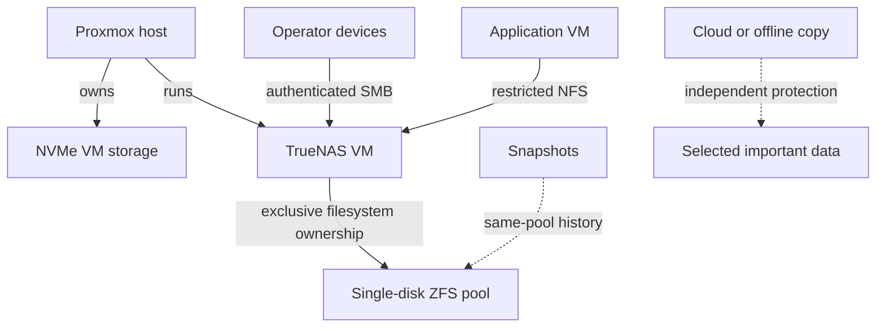
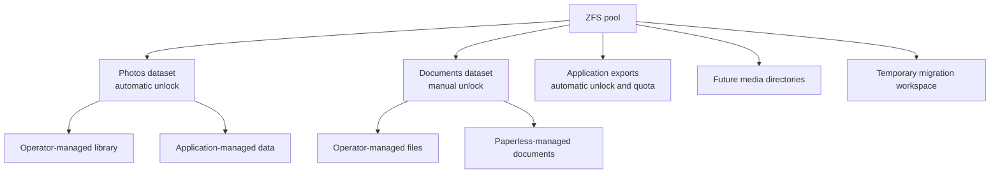
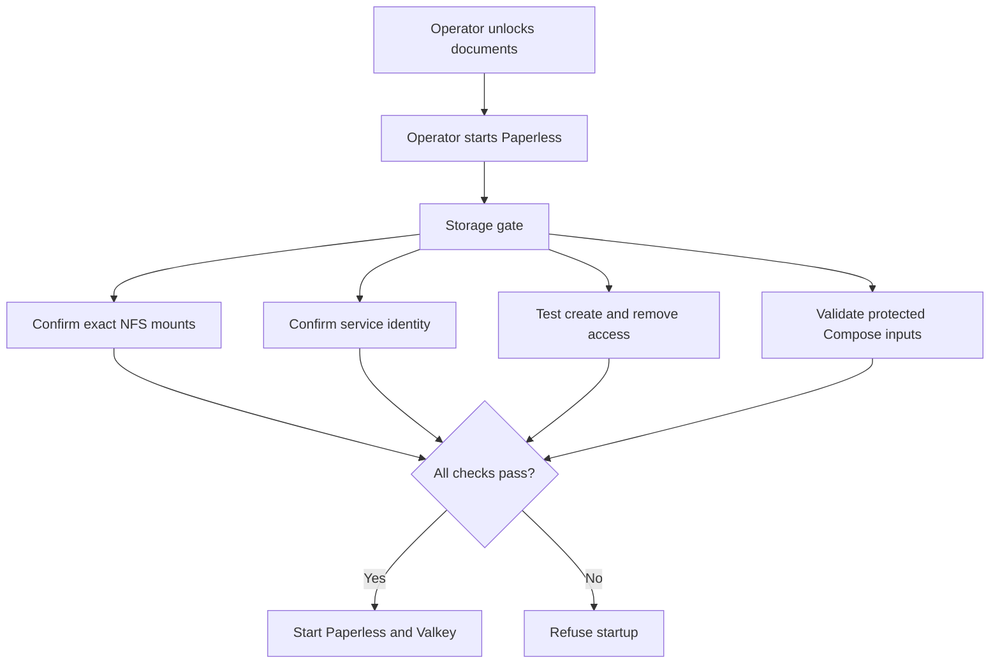

Part 3 ended with a replacement 10 TB drive that had finally passed its extended SMART test.

The disk was healthy, empty, and deliberately unassigned. That only answered whether I *could* use it. Part 4 needed to answer a harder question: what would I trust it to do?

I wanted one storage layer for photos, documents, future media, and temporary migration work. I also wanted the applications using that storage to have narrower access than I did. Most importantly, I did not want a single successful pool-creation screen to trick me into thinking I had redundancy or a backup.

By the end of this part, the disk belongs to a dedicated TrueNAS VM, the first ZFS pool is online, storage is available to both people and applications through different protocols, and Paperless-ngx is ingesting and searching documents.

The interesting work was everything between “the disk works” and “the application is running.”

## Giving the disk one owner

The first architectural decision was ownership.

I could have kept the disk under Proxmox and shared directories from the host. Instead, I created a dedicated TrueNAS SCALE VM and passed the complete physical disk through to it. Proxmox owns the virtual boot disk and the VM lifecycle. TrueNAS alone owns the data disk, its filesystem, and every write to it.

That boundary matters because two systems should never believe they own the same filesystem.

The VM uses four virtual CPUs, a fixed 8 GiB of memory, and a small NVMe-backed boot disk. I considered buying another 32 GiB RAM stick before installing it, but measured the current host under simultaneous load first. The system retained roughly 10 GiB of available memory with no active swapping or memory-pressure stalls, so the upgrade was not justified yet.

The first pool attempt still found a very virtualized kind of problem. TrueNAS saw the virtual boot disk and passed-through data disk with duplicate empty serial values and refused the topology. Giving the two virtual devices distinct aliases resolved the ambiguity while the real hardware identity remained recorded privately.

That failure was useful. A storage appliance should be suspicious when two disks appear indistinguishable.

## A ZFS pool is not automatically redundant

TrueNAS warned that a one-disk data VDEV was discouraged. It was right.

I accepted the warning because this is intentionally the first stage of the storage plan, not the finished design. The pool gives me ZFS checksums, compression, snapshots, scrubs, quotas, encryption boundaries, and a clean path toward a future mirror. It cannot reconstruct a damaged block from a second member, and losing the disk would still mean losing the pool.

That distinction is easy to blur:

- ZFS checksums can detect corruption.
- Snapshots can preserve earlier versions on the same pool.
- A future mirror can improve availability.
- Only an independent copy protects against losing the entire pool or machine.

The legacy source disks therefore remain intact and read-only. Nothing gets repurposed until migration is verified with counts, sizes, checksums, representative file opens, application checks, and an explicit sign-off. The new pool is a destination under test, not an excuse to erase the sources.

I configured value-based snapshot schedules for photos and documents, including their child datasets. Those snapshots are useful short-term history, but they remain on the only pool disk. A weekly scrub is configured as well, although I am waiting to record a meaningful completed scrub after the pool holds more real data.

## Datasets are policies, not partitions

My first mental model treated ZFS datasets a little like flexible partitions. That was not completely wrong, but it missed their most useful property.

A dataset is a policy boundary. It can have its own encryption behavior, snapshot schedule, quota, permissions, and sharing rules without reserving a fixed slice of disk in advance. Ordinary directories are still better when I only need organization inside one policy boundary.

The resulting layout separates four kinds of responsibility:

The photo library and photo-application data are separate because they have different owners. The operator-managed library is the source of truth and can be exposed read-only to an application. The application's thumbnails, database-adjacent files, and generated data belong in a different writable boundary.

Documents follow the same idea. General files and Paperless-managed content have separate access policies even though both inherit the sensitive documents boundary. Application exports are separated because they have different retention and recovery behavior. They are not another copy of the live data, and an export on the same pool is still not a backup.

Encryption also follows value rather than convenience. Photo and export datasets unlock automatically. The documents dataset requires a passphrase after a TrueNAS restart. I tested the reboot behavior: automatic datasets returned on their own, documents stayed locked, and unlocking the parent made its child datasets available.

That deliberate inconvenience became an application-startup requirement later.

## SMB for people, NFS for applications

I initially thought of SMB and NFS as two interchangeable ways to reach the same files. In this design they represent different trust boundaries.

Authenticated SMB is for interactive access from my Mac. It supports a normal user login and lets me browse the photo library and general documents without giving the account administrative access to TrueNAS.

NFS is for application VMs. Each export is restricted to the approved client and mapped to a dedicated non-login service identity. The photo library is read-only to applications. Application-owned photo data, Paperless storage, and the export area are writable only through their intended identities.

I tested both sides of that policy. The application VM could list the photo library but could not create a file there. It could create and remove disposable files in each writable application path. The Mac could authenticate to the operator shares and browse them normally.

The NFS mounts use systemd automounts. The application VM can boot even if TrueNAS is unavailable, but accessing a locked or missing dataset must not quietly turn an ordinary local directory into “storage.” That is the dangerous failure mode: an application appears healthy while writing important files to the VM's small local disk.

## Paperless needed a storage gate, not just a volume mount

With the storage layer working, Paperless-ngx became the first application allowed to depend on it.

This deployment added two containers: Paperless itself and a dedicated Valkey broker. Paperless uses an isolated role and database in the existing PostgreSQL service. PostgreSQL and Valkey remain internal and do not publish host ports. Both new containers run as a dedicated non-login identity rather than root.

I deliberately left out Tika and Gotenberg. Paperless is an archive for scans, PDFs, images, and finalized documents—not a live Office-document editor. Adding conversion services before I had a real workflow for them would increase the deployment and recovery surface without solving the problem I actually had.

The unusual part is how Paperless starts.

A small, root-controlled systemd unit runs the storage gate before Compose. The gate confirms that the expected paths resolve to the real NFS layers, verifies the service identity and protected configuration metadata, and performs create/remove probes through the same account that Paperless uses.

It also had to understand an implementation detail I did not expect: systemd automount and NFS can appear as stacked mount records for the same path. The first version treated the parent automount record as suspicious even when the real NFS layer was present. The corrected gate selects and validates the actual NFS layer rather than assuming one mount-table row per path.

The gate now passes against the live mounts. The complete post-deployment test—locking the documents dataset and proving startup refusal end to end—remains configured but not yet retested. I would rather state that gap than turn intended behavior into fictional evidence.

## Testing a document instead of celebrating a login screen

Once both containers were healthy, I created the administrator account and used a disposable synthetic PDF for acceptance testing.

The useful workflow passed:

- the web interface ingested the PDF;
- unique text from it was searchable;
- a tag persisted;
- the document and metadata survived a controlled restart;
- a second synthetic document placed in the NFS consumption folder was picked up automatically; and
- the exporter produced a manifest that parsed as valid JSON.

I removed the disposable records after the test. No personal document content was needed to prove the workflow.

The last step was checking whether the host still had room. With TrueNAS, Paperless, the other core services, Homepage, and the development VM running, the host still reported roughly 10 GiB available, effectively no host swap use, and no measured memory-pressure stalls.

Proxmox made the development VM look nearly full because it accounted most of the VM's fixed 10 GiB allocation as host memory. Inside the guest, only about 1.3 GiB was actually used and roughly 7.8 GiB remained available. Hypervisor allocation and guest pressure are related, but they are not the same measurement.

The current 32 GiB host is enough for this tested workload. That is not a promise about future photo processing, heavier coursework, or more services. It is simply no evidence-based reason to buy RAM today.

## A backup is only as strong as the test it passed

Paperless stores several different kinds of state: documents on TrueNAS, application data on the Docker VM, PostgreSQL metadata, protected configuration, and portable application exports. Treating one archive as “the backup” would hide those boundaries.

I created a fresh PostgreSQL backup and restored every managed database into a temporary network-isolated PostgreSQL container using memory-backed storage. Each restored database answered a validation query, and the temporary container was removed afterward. That is stronger evidence than a checksum alone.

I also created a protected Docker configuration archive, verified its checksums and catalog, extracted it into a root-only staging directory, and compared it with the live sources without printing secrets. No differences were found.

Paperless's own exporter produced a valid manifest, but I have not imported it into an isolated Paperless instance. It also remains on the same ZFS pool as the managed documents. Therefore:

- the PostgreSQL backup is restore-tested at the database layer;
- the configuration archive is extraction-tested;
- the Paperless export is format-checked; and
- full Paperless recovery and independent off-system protection remain unfinished.

Those are four different claims, and collapsing them into “backups are done” would make the system sound safer than it is.

## Answering the questions from Part 3

Part 3 ended with seven storage questions. Part 4 produced an answer for each one, even when that answer still includes unfinished work.

- **Ownership:** Proxmox owns its VM and backup storage; TrueNAS exclusively owns the 10 TB data disk.
- **Disk roles:** The new disk is the primary pool, while the older disks remain read-only migration sources and external or cloud storage will hold selected independent copies.
- **Data separation:** Datasets define encryption, snapshot, quota, and permission boundaries; ordinary directories handle organization within a shared policy.
- **Application access:** People use authenticated SMB, while applications receive narrower host-restricted NFS access through dedicated service identities.
- **Protection:** Snapshots provide same-pool history, a future mirror can improve availability, and independent copies protect against losing the pool. Restore testing remains separate evidence.
- **Migration:** Data will move in verified stages, and no source disk will be repurposed until counts, checksums, representative files, and application checks pass.
- **Expansion:** A tested matching disk can eventually form a mirror after independent backups and a separately reviewed change, without redesigning the client-facing datasets and shares.

The answers are not all “finished.” They are explicit enough that the remaining risks and next decisions are visible.

## Where Part 4 ends

The storage plan is no longer a diagram waiting for a disk. TrueNAS owns the pool, access boundaries are enforced, encrypted documents require deliberate unlocking, and Paperless is using the storage for a validated daily workflow.

The important unfinished work is equally clear. The pool still has one disk. The first large migration has not happened. Important photos and documents still need verified copies in another failure domain. TrueNAS configuration restore, full Paperless import, and the complete locked-storage refusal test remain unfinished.

## What I am planning next

Before deploying another major application, I want to shorten the development loop that produced the Paperless scripts. The production path will continue to use reviewed GitHub `main`, but unfinished commits need an isolated VM integration path where host-specific checks can fail quickly without touching production.

After that, the next storage work is deliberately less glamorous:

- validate recursive snapshot behavior and record a meaningful scrub after more data is present;
- test TrueNAS configuration recovery and a complete isolated Paperless import;
- migrate selected data in stages while keeping the source disks intact;
- create verified independent copies for important documents, research, and photos; and
- deploy the photo-management service only after its storage, backup, and memory boundaries are ready.

The current 32 GiB host will be measured again under real photo-processing and coursework load. If that evidence supports a RAM upgrade, I will make it then rather than buying capacity for a dashboard percentage.

The disk finally has a job. The next challenge is proving that the data depending on it can survive losing it.
