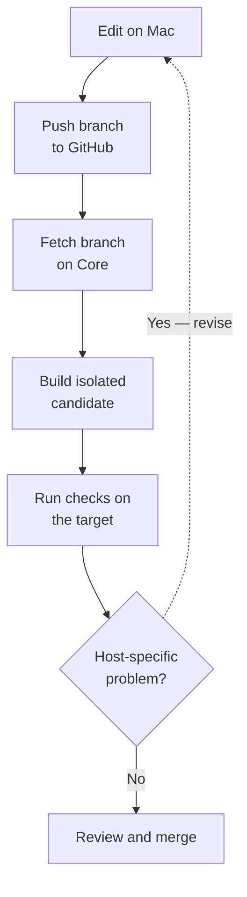
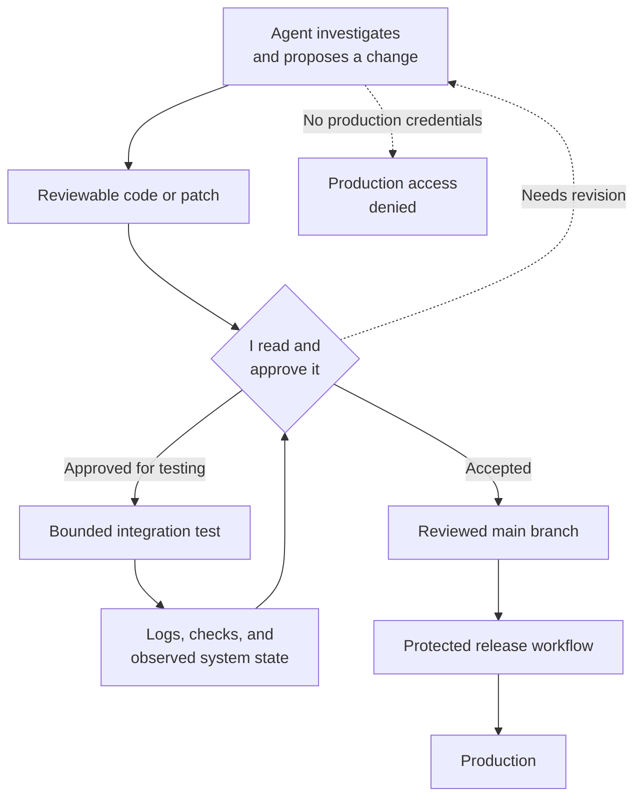
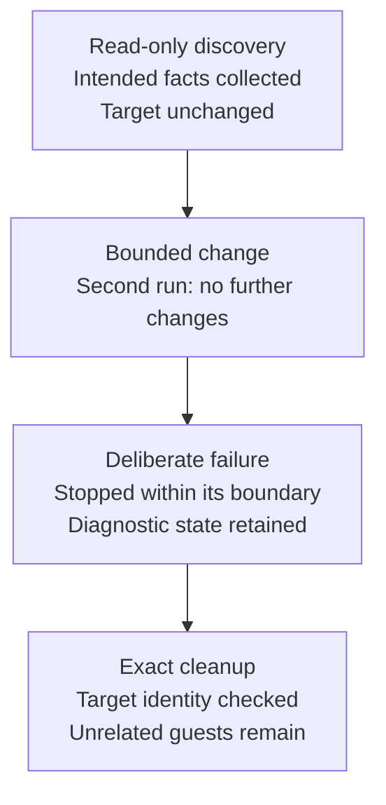

Part 4 ended with Paperless-ngx running against storage provided by TrueNAS. The application worked, its database backup had survived an isolated restore test, and its startup gate could tell the intended NFS mount from an ordinary local directory.

Building it also showed me how slow my development loop had become.

Many problems appeared only after code reached the Docker VM. A script could pass every local check and still fail because systemd handled a dependency differently, an NFS automount appeared in an unexpected form, or the target’s permissions did not match my development environment.

Each correction followed roughly the same route:



The process protected production, but GitHub had become the transport for every unfinished experiment as well as the review boundary for finished work. I wanted a shorter feedback loop.

Before designing one, I had to decide how much control I was willing to give the AI agents helping me build the lab.

## Why I did not give the agents the keys

Agents were already helping me research designs, write scripts, inspect failures, and maintain documentation. I could have given one an unrestricted terminal and let it keep trying commands until the service worked.

I chose a more deliberate workflow.

The lab contains personal data, production applications, credentials, and services with dependencies that are not always visible from one configuration file. A command that looks safe can still affect a mount, firewall rule, database, or startup sequence somewhere else.

I also did not want to become someone who could only operate his own infrastructure by asking an agent what to type next.

A confirmation prompt is a weak control if I do not understand the command before pressing Enter. I wanted the agent to help me do more work, but I still wanted to learn from that work and remain capable of fixing the system without it.

My working rules became:



This approach took longer than letting an agent improvise directly on a live host. The extra time forced me to learn Ansible, systemd, Docker networking, SSH trust, Linux permissions, and the failure behavior of my own scripts.

The integration environment had to support that way of working. It needed to protect production from unfinished code while making every proposed change visible enough for me to review.

## Testing closer to production

My first attempt placed a restricted development path on the Core Docker VM.

My Mac could send work-in-progress commits to a dedicated Git receiver. The VM would prepare a candidate from an exact commit in a separate directory, and trusted host-side tools could inspect it.

The candidate could not replace the live deployment. It did not automatically receive production secrets, root access, writable application storage, or permission to promote itself. Production still came from reviewed GitHub `main` through the existing deployment process.

This shortened the feedback loop and preserved a useful record of exactly what I had tested.

It also added development machinery to an application host.

A complete version of the design needed repository ownership rules, candidate directories, privilege boundaries, cleanup behavior, and test orchestration on Core. Future Docker hosts would need similar machinery.

>**Core was gradually becoming responsible for the tools used to modify Core.**

I decided that development and automation needed their own home.

## Building the management VM

I created a dedicated Debian VM named **Vishwakarma** to act as the management control plane.

I named it [Vishwakarma](https://en.wikipedia.org/wiki/Vishvakarma), the craftsman deity and divine architect in Hindu tradition. The name fit a machine responsible for building, validating, and coordinating the rest of the lab.

It started with two virtual CPUs, a small memory allocation, an NVMe-backed virtual disk, private network access, and no application workload. Its first responsibilities were remote development, repository validation, and Ansible orchestration.

The design separated ordinary development from production authority.

The development account had an editable checkout, development tools, and access to the integration environment. A protected release path held the production inventory, SSH identity, host trust, and a checkout of reviewed GitHub `main`.

Code running as the development user could not use the production credentials. Passing an integration test did not grant deployment access. A production operation required a deliberate move into the protected release workflow.

I used separate SSH identities for the two paths. The integration identity could reach an integration target. The production identity could reach the production host only through the protected workflow.

I tested the boundary from both directions. The protected release path could authenticate to production, while the ordinary development account could not read, traverse, parse, or use the production inventory and private key.

The flow looked like this:

```mermaid size=standard caption="Development and production authority separation"
flowchart TB
    accTitle: Development and production authority separation
    accDescr: Mac development reaches a management controller development workspace and a disposable integration guest, while reviewed GitHub main enters a separate protected release lane with production credentials and access to production hosts.
%% panel MGMT "Vishwakarma management VM": DEV,RELEASE,DENIED

    MAC["Mac<br/>authoring and review"]
    GITHUB["GitHub<br/>reviewed main"]
    DEV["Development workspace<br/>editable branches<br/>integration identity"]
    RELEASE["Protected release lane<br/>production inventory<br/>production identity"]
    DENIED["Production credentials<br/>unavailable to development"]
    INTEGRATION["Disposable integration guest<br/>no production secrets or data"]
    PRODUCTION["Production hosts"]
    OUTPUT_ROW(( ))

    MAC --> DEV
    GITHUB --> RELEASE
    DEV --> INTEGRATION
    RELEASE --> PRODUCTION
    DEV -. "Denied" .-> DENIED
    DEV ~~~ OUTPUT_ROW
    RELEASE ~~~ OUTPUT_ROW
    OUTPUT_ROW ~~~ INTEGRATION
    OUTPUT_ROW ~~~ PRODUCTION

    class MAC,GITHUB source;
    class DEV,INTEGRATION control;
    class RELEASE,PRODUCTION approved;
    class DENIED denied;
    class OUTPUT_ROW layout;
```

Vishwakarma controlled deployments, but applications did not depend on it to remain online. If the management VM stopped, the services it had deployed would continue running. I also retained direct Proxmox access as a recovery path if the management VM itself became unreachable.

## Creating a disposable integration environment

The first integration design used temporary Proxmox guests.

A minimal Debian template could produce a linked clone for a bounded test. The clone used integration-only credentials and contained no production secrets or application data. It had no writable access to production storage and could not act as a production replacement.

Before attempting a full application deployment, I tested the workflow with smaller pilots.

The first pilot performed read-only discovery through Ansible. It confirmed that the management VM could reach the guest, collect the intended facts, and stop without changing the target.

The second pilot made a bounded change. Running it again reported no further changes, which showed that the operation was idempotent.

Another pilot failed deliberately partway through. I checked that the failure stopped within its intended boundary, retained enough evidence for diagnosis, and allowed a controlled recovery.

The cleanup workflow then removed the exact guest and its controller-side state. It checked the target identity before deletion and verified that unrelated guests remained in place.

These pilots tested more than the successful path. They tested how the system behaved when a task repeated, stopped halfway through, or needed to be removed.

They also tested the human side of the workflow. An agent might draft an Ansible role or explain why an audit failed, but I still reviewed the patch, applied it, ran the approved operation, and returned the result for the next round of analysis.

That loop was slower than autonomous trial and error. It also meant that I knew what had changed on the host and why.



## What the first environment could do

By the end of the pilots, the management VM could:

- rebuild its development tools from pinned requirements;
- keep development and production credentials separate;
- inspect an integration guest without changing it;
- apply a bounded change that repeated without further mutation;
- stop safely during a deliberate failure;
- remove integration access and controller state after a test; and
- begin production work from reviewed GitHub `main`.

The disposable guest reproduced enough of a real host to test Linux, systemd, Docker, permissions, and application installation. Some operations still belonged in supervised maintenance windows. A temporary guest could not reproduce every Proxmox, TrueNAS, network, or production-data condition.

The pilots also tested small, controlled changes. I had not yet tried to use the environment for an application lifecycle that included host preparation, source intake, Docker installation, firewall policy, backup, restore, recovery, and cleanup.

That test came with Homelable.

## Coming next

The first Homelable attempt did not fail because the application was unusually difficult to run. The surrounding guest lifecycle became the larger problem.

Before testing the application, the workflow had to coordinate guest creation, address discovery, SSH trust, protected inventory, source preparation, and eventual cleanup. A failure halfway through could leave valid state on the controller even when the guest itself was disposable.

The isolation model worked, but routine use demanded too much human coordination. In Part 6, I will cover that failed attempt, the move to a persistent integration host, and the application test that finally closed this chapter of the homelab’s development workflow.
