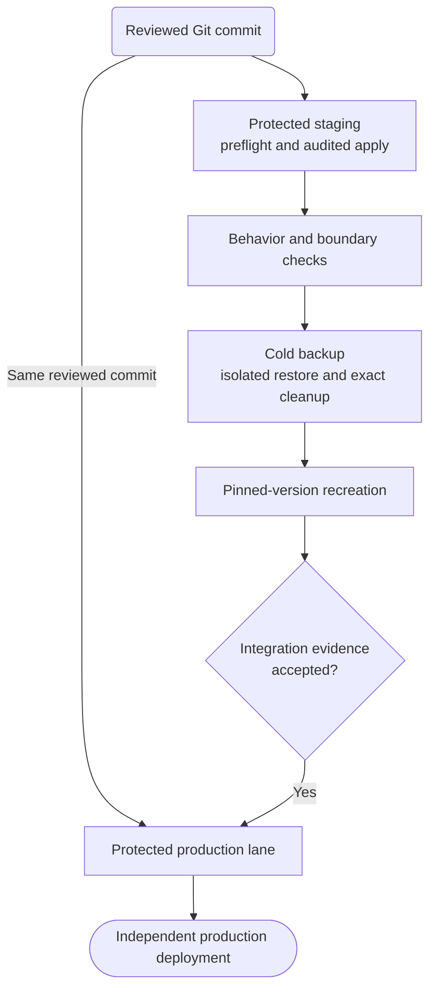
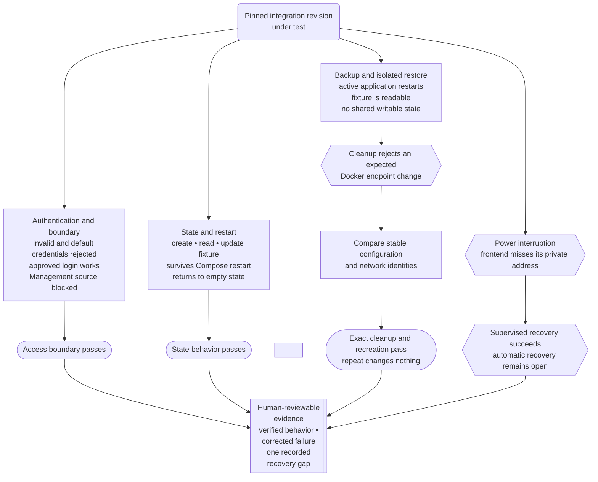

[Part 5](/blog/building-my-homelab-part5/) ended with a disposable integration guest that could survive a deliberate failure, recover, and disappear without touching production. The isolation worked. I still did not know whether the process could handle a real application.

I chose [Homelable](https://github.com/Pouzor/homelable), a self-hosted network documentation application, for the first complete test. It was small enough for me to understand, but substantial enough to require a frontend, backend, persistent state, authentication, firewall policy, backup, and recovery.

## The application that never started

The disposable guest from Part 5 worked well for bounded automation pilots. Each test started from a known Debian template, used an integration-only identity, and ended with exact cleanup.

A complete application test required much more coordination. The workflow had to create the guest, discover its address, establish its identity, enroll SSH trust, add protected inventory, prepare the operating system and Docker, stage an exact repository revision, run the application lifecycle, and eventually remove both guest and controller state.

The order mattered. Trust enrollment depended on address discovery. Host preparation depended on trust and inventory. Cleanup needed to know exactly how far the workflow had progressed.

One run reached an awkward partial state. Cloud-init completed inside the guest, but Proxmox reported a generated configuration deprecation. The workflow stopped with valid SSH trust on the controller but no fully admitted integration target. The cleanup path understood a complete guest and a hostless state. It did not understand this trust-only state.

By then, the repository contained substantial machinery for creating and qualifying a machine. Homelable had not started.

> The first attempt never ran Homelable. It proved that I was recreating too much state for every application test.

The disposable model had protected production. Its lifecycle boundary was too large for routine service work.

```mermaid size=standard caption="Disposable and persistent integration lifecycles"
flowchart TB
    accTitle: Moving from disposable guests to a persistent integration host
    accDescr: The disposable model recreated guest, network, trust, Docker, and controller state for every workload. The persistent model qualifies the machine once and repeats only the application lifecycle.

    OLD("Disposable guest<br/>for every<br/>workload")
    O1["Create guest"]
    O2["Discover<br/>address and<br/>enroll trust"]
    O3["Prepare<br/>operating<br/>system and<br/>Docker"]
    O4["Test<br/>application"]
    O5(["Remove guest<br/>and controller<br/>state"])

    NEW("Persistent<br/>integration host")
    N1["Qualify machine<br/>once"]
    N2["Retain identity,<br/>trust, runtime<br/>and firewall"]
    N3["Stage exact<br/>workload<br/>revision"]
    N4["Test<br/>application<br/>lifecycle"]
    N5(["Reset workload<br/>or approved<br/>baseline"])

    OLD -.-> O1 -.-> O2 -.-> O3 -.-> O4 -.-> O5
    NEW -->|"Qualify once"| N1 --> N2 --> N3 --> N4 --> N5

    class OLD,NEW source;
    class O1,O2,O3,O4,N1,N2,N3,N4 process;
    class O5,N5 approved;
```

*The temporary design recreated the machine lifecycle. The persistent design repeats the workload lifecycle.*

## Keeping the host and replacing the workload

I replaced the temporary guest with one persistent integration host.

The VM exists only for non-production service validation and can be shut down when it is not in use. Its identity, inventory entry, SSH trust, operating-system baseline, and Docker installation remain stable between tests.

Ansible owns the automation account, Docker runtime, production-shaped filesystem layout, firewall policy, workload audits, and deployment records. The host contains no production SSH identity, production secrets, production storage mounts, or production database access. Management comes through Vishwakarma, and application access is limited to an approved test client.

A retained host brings its own risk. It can accumulate drift or stale workload state. Audits therefore have to prove what is present before each test rather than assuming that the machine is clean.

Before installing Homelable, I audited the empty host and captured a supervised baseline snapshot. The snapshot covered the VM’s storage without capturing memory. It provided a reviewed reset point if the workload later needed to be abandoned.

The snapshot remained in the same failure domain as the VM. It did not prove total-loss reconstruction, and I had not tested rollback. I recorded those limits rather than calling it a backup.

## One revision, two paths

The integration host needed application definitions from Git, but it did not need a Git credential or an editable checkout.

Vishwakarma created a `git archive` from one selected commit. The archive contained committed, tracked files without Git history, working-tree changes, or credentials.

The protected integration workflow staged the archive, verified it, and expanded it into a commit-specific, root-controlled, read-only source tree. An independent audit compared the prepared tree with the staged archive before workload automation could use it.

Production never received that integration tree. After human review, the protected production lane independently consumed the same Git commit. Integration supplied evidence about a revision without becoming a promotion path.

## Testing the complete lifecycle

The application test covered more than container health. It followed the revision from source intake through functional testing, backup, restore, recreation, and finally an independent production deployment.



>*Integration produced evidence. Production started independently from the reviewed commit.*

The first Homelable apply created both expected containers, and they were healthy. The independent audit still stopped the workflow.

Docker represented the backend bind through its effective mount inventory rather than the redundant field the auditor expected. It also canonicalized capability names by adding `CAP_` prefixes. The application matched the intended security boundary; the auditor did not understand Docker’s representation of it.

I preserved the partial workload, firewall state, and deployment evidence. Deleting everything and retrying would have removed the best evidence from the failed run.

The corrected auditor compared the effective mount and accepted Docker’s canonical capability spelling without allowing additional privileges. A recovery run then audited the retained workload against the revision that created it. It did not rewrite the deployment record to imply another deployment.

>Audits can miss unsafe state, but they can also reject safe state because their model is wrong. Both failures matter.

## Testing behavior and recovery

I tested authentication, network access, state persistence, and recovery separately. The diagram below records the checks and their outcomes. Repeating the apply, restart, and acceptance workflows made no changes.

The backup test stopped the application in a controlled order, captured the recovery set, and restarted the active deployment. The restored copy used separate filesystem paths, private Docker networks, and no published host port.

Two tests exposed assumptions in the automation. Cleanup initially treated Docker’s removal of volatile endpoint fields as an identity mismatch. I changed the check to compare stable configuration and network identities, after which exact cleanup and a zero-change repeat passed. A power interruption exposed a separate boot-order race. Supervised Compose reconciliation restored the service, but automatic recovery from that sequence remained unproven.

Finally, I recreated both containers from the same pinned Homelable version. Their data and networks remained in place, and the login, sanitized test state, and Management-source denial still worked.



## Taking the revision to production

I had intentionally written the integration scripts for reuse on the production VM. The deployment, backup, restore, and cleanup logic stayed the same; production supplied only its own paths and secrets.

```mermaid size=standard caption="Taking the reviewed revision to production"
flowchart TB
    accTitle: Taking the reviewed revision to production
    accDescr: Integration evidence for a reviewed revision reaches a human approval gate. Rejection blocks production. Approval opens a protected production lane that independently consumes the same revision and reusable lifecycle scripts with production-specific paths and secrets. Production acceptance either succeeds or leaves the release unaccepted with its evidence preserved. Both non-success states return to correction, review, and testing before another reviewed revision enters the workflow.

    C("Reviewed Git revision")
    E[["Integration evidence<br/>for the same revision"]]
    H{"Evidence accepted?"}
    BLOCK{{"Production remains blocked"}}
    P["Protected production lane<br/>same reusable lifecycle scripts<br/>production paths and secrets"]
    D["Fresh production deployment<br/>no integration runtime or state"]
    A{"Production acceptance<br/>checks pass?"}
    SUCCESS(["Production accepted"])
    HOLD{{"Release remains unaccepted<br/>evidence preserved for correction"}}
    REWORK["Correct, review,<br/>and retest"]

    C --> E --> H
    H -->|"No"| BLOCK
    C -->|"Same reviewed revision"| P
    H -->|"Yes"| P
    P --> D --> A
    A -->|"Yes"| SUCCESS
    A -->|"No"| HOLD
    BLOCK -.-> REWORK
    HOLD -.-> REWORK
    REWORK -.->|"Next reviewed revision"| C

    class C source;
    class E evidence;
    class H,A human;
    class P,SUCCESS approved;
    class D,REWORK process;
    class BLOCK failure;
    class HOLD warning;
```

Production began from the reviewed Git commit through the protected release lane. It did not inherit the integration source tree, containers, credentials, or data.

The production deployment repeated the read-only plan, apply audit, approved-client and denied-source checks, login tests, deliberate restart, cold backup, isolated restore, exact cleanup, and zero-change repeats.

Homelable reached production healthy and seeded-empty, with no real topology or personal data. Two application backup generations completed, and one was started and inspected through an isolated restore. A separate Proxmox guest backup also completed on the dedicated backup disk.

I did not retrieve individual files from that guest archive or perform a temporary full-VM restore. HTTPS, automatic handling of the boot-time address race, independent transport of the application archive, snapshot rollback, and clean-room reconstruction remained open.

The validated result was one complete path from reviewed source through integration evidence and into an independent production deployment.

## Closing the integration chapter

The persistent host moved the lifecycle boundary to the application. I qualified the operating system, identity, Docker runtime, filesystem, and firewall once. Each workload then carried its own source, credentials, state, deployment evidence, backup, restore, and removal rules.

Homelable exercised that model through installation, failure, correction, restart, backup, isolated restore, cleanup, recreation, and production acceptance. The remaining recovery gaps stayed recorded instead of becoming assumptions attached to a successful deployment.

## Coming next

The implementation crossed many pull requests, failed gates, revised decisions, and sessions with different agents. A chat transcript could not serve as the project’s memory.

In Part 7, I will cover the agentic workflow behind the work: ADRs and checkpoints, bounded tasks, skills, subagents, independent review, patch handoffs, and the human approval points that kept long-running AI-assisted engineering understandable. I will also cover where the process became too heavy and what I changed to remain involved in the engineering rather than becoming a passenger.
